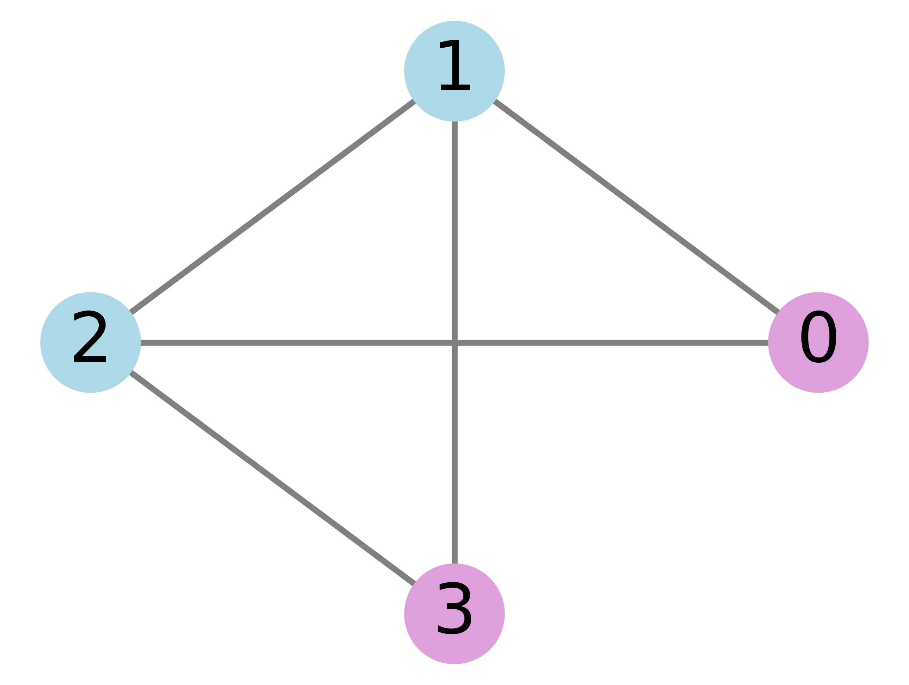
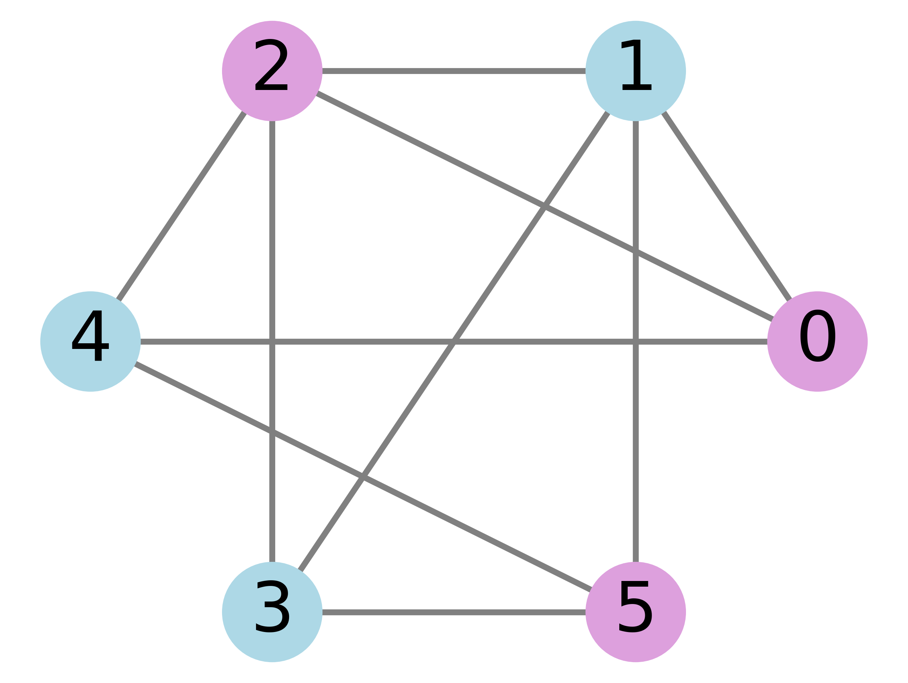
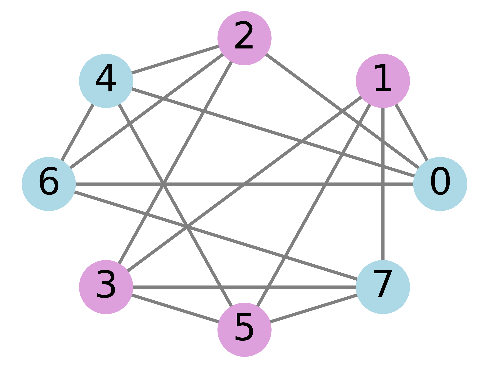
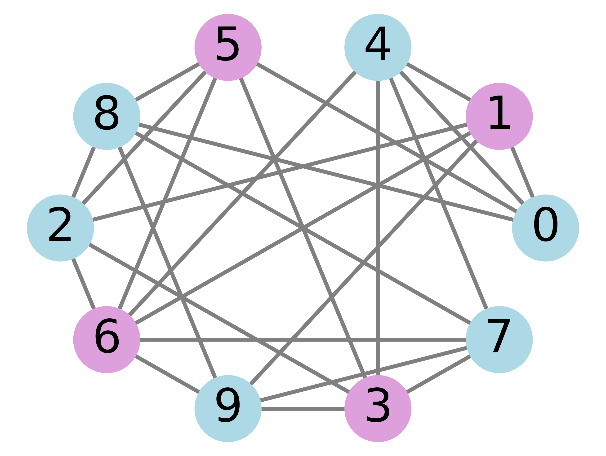
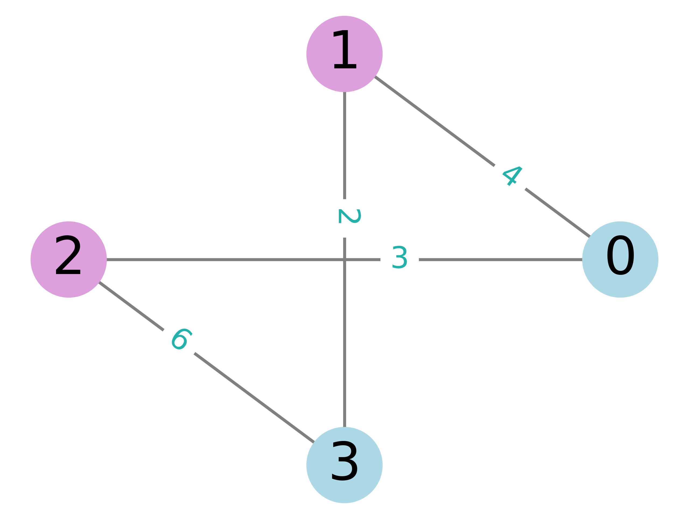
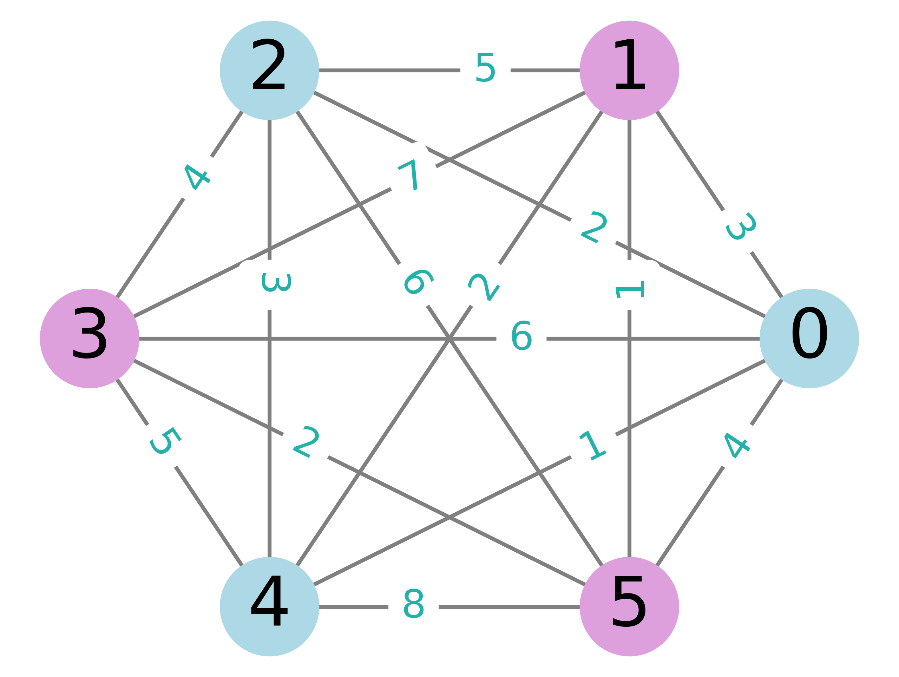
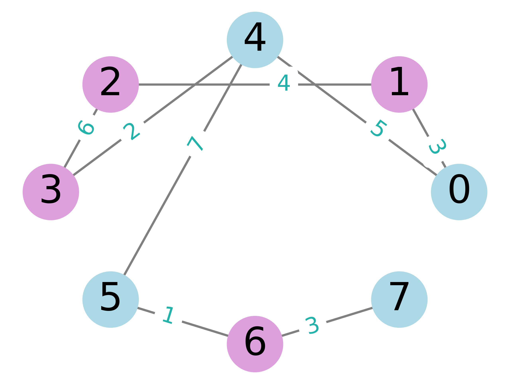

# Quantum Chemistry Ground State Energy Estimation

Note: Random seeds and model parameters are modified in the code body, not by passing parameters through the command line.

## $\rm HeH^{+}$

### Command

```bash
nohup python -u main.py \
  --problem "Quantum Chemistry Ground State Energy Estimation" \
  --freeze_core No \
  --mapper Parity \
  --atoms "He,H" \
  --coords "[(0.0, 0.0, 0.0), (1.0, 0.0, 0.0)]" \
  --charge 1 \
  --multiplicity 1 \
  --qubits 2 \
  --depths 10 \
  --internal_cycles 500 \
  --external_cycles 100 >> nohup1.out &
```

### Partial results

```bash
Optimal molecular ground state energy: -3.9185595439187515
Depth: 10
Standard: -3.9185595444198014
Error: 5.01049868262271e-10
```

## $\rm H_{2}$

### Command

```bash
nohup python -u main.py \
  --problem "Quantum Chemistry Ground State Energy Estimation" \
  --freeze_core No \
  --mapper JordanWigner \
  --atoms "H,H" \
  --coords "[(0.0, 0.0, -0.35), (0.0, 0.0, 0.35)]" \
  --charge 0 \
  --multiplicity 1 \
  --qubits 4 \
  --depths 20 \
  --internal_cycles 500 \
  --external_cycles 500 >> nohup1.out &
```

### Partial results

```bash
Optimal molecular ground state energy: -1.8921568967266147
Depth: 19
Standard:-1.8921568982373556
Error:1.5107408657399901e-09
```

## $\rm H_{2}^{+}$

### Command

```bash
nohup python -u main.py \
  --problem "Quantum Chemistry Ground State Energy Estimation" \
  --freeze_core No \
  --mapper JordanWigner \
  --atoms "H,H" \
  --coords "[(0.0, 0.0, -0.35), (0.0, 0.0, 0.35)]" \
  --charge 1 \
  --multiplicity 2 \
  --qubits 4 \
  --depths 25 \
  --internal_cycles 500 \
  --external_cycles 200 >> nohup1.out &
```

### Partial results

```bash
Optimal molecular ground state energy: -1.8921568974727603
Depth: 21
Standard: -1.8921568982373556
Error: 7.645952759816055e-10
```

## $\rm LiH-4$

### Command

```bash
nohup python -u main.py \
  --problem "Quantum Chemistry Ground State Energy Estimation" \
  --freeze_core Yes \
  --mapper Parity \
  --atoms "Li,H" \
  --coords "[(0.0, 0.0, 0.0), (0.0, 0.0, 2.2)]" \
  --charge 0 \
  --multiplicity 1 \
  --remove_orbitals 0,4,5 \
  --qubits 4 \
  --depths 38 \
  --internal_cycles 1500 \
  --external_cycles 500 >> nohup1.out &
```

### Partial results

```bash
Optimal molecular ground state energy: -0.7948319571133685
Depth: 35
Standard: -0.7949564571198138
Error: 1.0655694471228827e-06
```

## $\rm LiH-6$

### Command

```bash
nohup python -u main.py \
  --problem "Quantum Chemistry Ground State Energy Estimation" \
  --freeze_core Yes \
  --mapper JordanWigner \
  --atoms "Li,H" \
  --coords "[(0.0, 0.0, 0.0), (0.0, 0.0, 1.595)]" \
  --charge 0 \
  --multiplicity 1 \
  --remove_orbitals 0,4,5 \
  --qubits 6 \
  --depths 45 \
  --internal_cycles 3000 \
  --external_cycles 800 >> nohup1.out &
```

### Partial results

```bash
Optimal molecular ground state energy: -1.0131310103200102
Depth: 45
Standard: -1.0140205386508085
Error: 0.0008895283307983615
```

# Combinatorial optimization problem

## The Unweighted Max-Cut Problem

### 4 node graph

#### Command

```bash
nohup python -u main.py \
  --problem "The Unweighted Max-Cut Problem" \
  --qubits 4 \
  --depths 30 \
  --internal_cycles 2000 \
  --external_cycles 100 \
  --graph_dict "$(cat CO_Instances/The_Unweighted_Max-Cut_Problem/4_nodes.json)" >> nohup1.out &
```

#### Partial results

```bash
Depth: 24
Standard: -3.9999999999999996
Error: 1.894342460673215e-09
The value of the maximum cut is: 4.0
The corresponding grouping scheme is as follows:
[0 1 1 0]
[1 0 0 1]
Analog measurement results:
{'0110': 1024}
```

<div style="text-align: center;">
  
</div>

### 6 node graph

#### Command

```bash
nohup python -u main.py \
  --problem "The Unweighted Max-Cut Problem" \
  --qubits 6 \
  --depths 30 \
  --internal_cycles 2000 \
  --external_cycles 300 \
  --graph_dict "$(cat CO_Instances/The_Unweighted_Max-Cut_Problem/6_nodes.json)" >> nohup1.out &
```

#### Partial results
```bash
Depth: 27
Standard: -8.0
Error: 7.315601457946741e-09
The value of the maximum cut is: 8.0
The corresponding grouping scheme is as follows:
[0 1 0 1 1 0]
[1 0 1 0 0 1]
Analog measurement results:
{'010110': 1024}

```
<div style="text-align: center;">
  
</div>

### 8 node graph

#### Command

```bash
nohup python -u main.py \
  --problem "The Unweighted Max-Cut Problem" \
  --qubits 8 \
  --depths 40 \
  --internal_cycles 2000 \
  --external_cycles 300 \
  --graph_dict "$(cat CO_Instances/The_Unweighted_Max-Cut_Problem/8_nodes.json)" >> nohup1.out &
```
<div style="text-align: center;">
  
</div>

#### Partial results

```bash
Depth: 40
Standard: -12.000000000000009
Error: 1.7107348426748104e-08
The value of the maximum cut is: 12.0
The corresponding grouping scheme is as follows:
[0 1 0 1 1 0 1 0]
[0 1 1 0 0 1 1 0]
[0 1 1 0 1 0 0 1]
[1 0 0 1 0 1 1 0]
[1 0 0 1 1 0 0 1]
[1 0 1 0 0 1 0 1]
Analog measurement results:
{'01100110': 520, '10010110': 504}
```

### 10 node graph

#### Command

```bash
nohup python -u main.py \
  --problem "The Unweighted Max-Cut Problem" \
  --qubits 10 \
  --depths 40 \
  --internal_cycles 2000 \
  --external_cycles 300 \
  --graph_dict "$(cat CO_Instances/The_Unweighted_Max-Cut_Problem/10_nodes.json)" >> nohup1.out &
```
<div style="text-align: center;">
  
</div>

#### Partial results
```bash
Depth: 39
Standard: -18.999999999999993
Error: 0.015764475705267955
The value of the maximum cut is: 19.0
The corresponding grouping scheme is as follows:
[0 0 1 0 1 1 0 1 0 1]
[0 1 0 1 0 0 1 0 1 0]
[1 0 1 0 1 1 0 1 0 1]
[1 1 0 1 0 0 1 0 1 0]
{'0110110101': 10, '1010010101': 1, '1010110101': 1013}
```

## The Weighted Max-Cut Problem

### 4 node graph

#### Command

```bash
nohup python -u main.py \
  --problem "The Unweighted Max-Cut Problem" \
  --qubits 4 \
  --depths 30 \
  --internal_cycles 2000 \
  --external_cycles 100 \
  --graph_dict "$(cat CO_Instances/The_Weighted_Max-Cut_Problem/4_nodes.json)" >> nohup1.out &
```
<div style="text-align: center;">
  
</div>

#### Partial results

```bash
Depth: 27
Standard: -15.00000000000001
Error: 3.5493155081667283e-09
The value of the maximum cut is: 15.0
The corresponding grouping scheme is as follows:
[0 1 1 0]
[1 0 0 1]
Analog measurement results:
{'0110': 1024}
```

### 6 node graph

#### Command

```bash
nohup python -u main.py \
  --problem "The Weighted Max-Cut Problem" \
  --qubits 6 \
  --depths 30 \
  --internal_cycles 2000 \
  --external_cycles 300 \
  --graph_dict "$(cat CO_Instances/The_Weighted_Max-Cut_Problem/6_nodes.json)" >> nohup1.out &
```
<div style="text-align: center;">
  
</div>

#### Partial results
```bash
Depth: 30
Standard: -43.000000000000014
Error: 4.4796763631893555e-08
The value of the maximum cut is: 43.0
The corresponding grouping scheme is as follows:
[0 1 0 1 0 1]
[1 0 1 0 1 0]
Analog measurement results:
{'101010': 1024}
```

### 8 node graph

#### Command

```bash
nohup python -u main.py \
  --problem "The Unweighted Max-Cut Problem" \
  --qubits 8 \
  --depths 50 \
  --internal_cycles 2000 \
  --external_cycles 300 \
  --graph_dict "$(cat CO_Instances/The_Weighted_Max-Cut_Problem/8_nodes.json)" >> nohup1.out &
```
<div style="text-align: center;">
  
</div>

#### Partial results

```bash
Depth: 46
Standard: -29.0
Error: 0.15280751351250288
The value of the maximum cut is: 29.0
The corresponding grouping scheme is as follows:
[0 1 0 1 1 0 1 0]
[1 0 1 0 0 1 0 1]
Analog measurement results:
{'01001100': 1, '01011010': 985, '01011011': 33, '01101010': 1, '10011010': 1, '10101000': 1, '10101010': 1, '11011010': 1}
```

## NAE-3-SAT

### 4 literals

#### Command

```bash
nohup python -u main.py \
  --problem "Not-All-Equal 3-Satisfiability" \
  --qubits 4 \
  --depths 10 \
  --internal_cycles 2000 \
  --external_cycles 20 \
  --clause "[[1, 2, 3],[-1, -2, 3],[1, -3, 4],[-1, -3, -4],[2, 3, -4],[-2, -3, -4]]" >> nohup1.out &
```

#### Partial results

```bash
Logic expression:
(x1 OR x2 OR x3) AND (NOT x1 OR NOT x2 OR x3) AND (x1 OR NOT x3 OR x4) AND (NOT x1 OR NOT x3 OR NOT x4) AND (x2 OR x3 OR NOT x4)

Depth: 10
Standard: -6.0
Error: 9.167857584202466e-10

Bit strings: ['0101', '1010']
Node status for all best solutions (node number: spin value):
Solution 1:
Node x1: Spin Value 1(-> 0)
Node x2: Spin Value -1(-> 1)
Node x3: Spin Value 1(-> 0)
Node x4: Spin Value -1(-> 1)
Solution 2:
Node x1: Spin Value -1(-> 1)
Node x2: Spin Value 1(-> 0)
Node x3: Spin Value -1(-> 1)
Node x4: Spin Value 1(-> 0)

Analog measurement results:
{'1010': 1024}
```

### 6 literals

#### Command

```bash
nohup python -u main.py \
  --problem "Not-All-Equal 3-Satisfiability" \
  --qubits 6 \
  --depths 20 \
  --internal_cycles 2000 \
  --external_cycles 50 \
  --clause "[[1, 2, 3],[-1, -2, 4],[1, -3, 5],[-1, 3, -5],[2, -4, 6],[-2, 4, -6],[-3, -5, 6],[3, 5, -6],[-1, -4, -6],[1, 4, -5],[2, -3, -4],[-2, -5, 6],[-1, -3, 6]]" >> nohup1.out &
```

#### Partial results

```bash
Logic expression:
(x1 OR x2 OR x3) AND (NOT x1 OR NOT x2 OR x4) AND (x1 OR NOT x3 OR x5) AND (NOT x1 OR x3 OR NOT x5) AND (x2 OR NOT x4 OR x6) AND (NOT x2 OR x4 OR NOT x6) AND (NOT x3 OR NOT x5 OR x6) AND (x3 OR x5 OR NOT x6) AND (NOT x1 OR NOT x4 OR NOT x6) AND (x1 OR x4 OR NOT x5) AND (x2 OR NOT x3 OR NOT x4) AND (NOT x2 OR NOT x5 OR x6) AND (NOT x1 OR NOT x3 OR x6)

Depth: 19
Standard: -4.000000000000003
Error: 1.3961408029672384e-08

Bit strings: ['010100', '011111', '100000', '101011']
Node status for all best solutions (node number: spin value):
Solution 1:
Node x1: Spin Value 1(-> 0)
Node x2: Spin Value -1(-> 1)
Node x3: Spin Value 1(-> 0)
Node x4: Spin Value -1(-> 1)
Node x5: Spin Value 1(-> 0)
Node x6: Spin Value 1(-> 0)
Solution 2:
Node x1: Spin Value 1(-> 0)
Node x2: Spin Value -1(-> 1)
Node x3: Spin Value -1(-> 1)
Node x4: Spin Value -1(-> 1)
Node x5: Spin Value -1(-> 1)
Node x6: Spin Value -1(-> 1)
Solution 3:
Node x1: Spin Value -1(-> 1)
Node x2: Spin Value 1(-> 0)
Node x3: Spin Value 1(-> 0)
Node x4: Spin Value 1(-> 0)
Node x5: Spin Value 1(-> 0)
Node x6: Spin Value 1(-> 0)
Solution 4:
Node x1: Spin Value -1(-> 1)
Node x2: Spin Value 1(-> 0)
Node x3: Spin Value -1(-> 1)
Node x4: Spin Value 1(-> 0)
Node x5: Spin Value -1(-> 1)
Node x6: Spin Value -1(-> 1)

Analog measurement results:
{'010100': 987, '101011': 37}
```

### 8 literals

#### Command

```bash
nohup python -u main.py \
  --problem "Not-All-Equal 3-Satisfiability" \
  --qubits 8 \
  --depths 50 \
  --internal_cycles 2000 \
  --external_cycles 100 \
  --clause "[[1, 2, 3], [-1, -2, 4], [1, -3, 5], [-1, 3, -5], [2, -4, 6], [-2, 4, -6], [-3, -5, 7], [3, 5, -7], [1, -2, -8], [-1, -6, 8], [-4, 7, -8], [2, -3, 6], [-7, 4, -5], [1, -8, 3], [-1, -3, -4], [-2, -6, -7], [5, -7, -8]]" >> nohup1.out &
```

#### Partial results

```bash
Logic expression:
(x1 OR x2 OR x3) AND (NOT x1 OR NOT x2 OR x4) AND (x1 OR NOT x3 OR x5) AND (NOT x1 OR x3 OR NOT x5) AND (x2 OR NOT x4 OR x6) AND (NOT x2 OR x4 OR NOT x6) AND (NOT x3 OR NOT x5 OR x7) AND (x3 OR x5 OR NOT x7) AND (x1 OR NOT x2 OR NOT x8) AND (NOT x1 OR NOT x6 OR x8) AND (NOT x4 OR x7 OR NOT x8) AND (x2 OR NOT x3 OR x6) AND (NOT x7 OR x4 OR NOT x5) AND (x1 OR NOT x8 OR x3) AND (NOT x1 OR NOT x3 OR NOT x4) AND (NOT x2 OR NOT x6 OR NOT x7) AND (x5 OR NOT x7 OR NOT x8)

Depth: 50
Standard: -6.000000000000011
Error: 6.541428945983085e-05

Bit strings: ['01011010', '01111010', '10000101', '10100101']
Node status for all best solutions (node number: spin value):
Solution 1:
Node x1: Spin Value 1(-> 0)
Node x2: Spin Value -1(-> 1)
Node x3: Spin Value 1(-> 0)
Node x4: Spin Value -1(-> 1)
Node x5: Spin Value -1(-> 1)
Node x6: Spin Value 1(-> 0)
Node x7: Spin Value -1(-> 1)
Node x8: Spin Value 1(-> 0)
Solution 2:
Node x1: Spin Value 1(-> 0)
Node x2: Spin Value -1(-> 1)
Node x3: Spin Value -1(-> 1)
Node x4: Spin Value -1(-> 1)
Node x5: Spin Value -1(-> 1)
Node x6: Spin Value 1(-> 0)
Node x7: Spin Value -1(-> 1)
Node x8: Spin Value 1(-> 0)
Solution 3:
Node x1: Spin Value -1(-> 1)
Node x2: Spin Value 1(-> 0)
Node x3: Spin Value 1(-> 0)
Node x4: Spin Value 1(-> 0)
Node x5: Spin Value 1(-> 0)
Node x6: Spin Value -1(-> 1)
Node x7: Spin Value 1(-> 0)
Node x8: Spin Value -1(-> 1)
Solution 4:
Node x1: Spin Value -1(-> 1)
Node x2: Spin Value 1(-> 0)
Node x3: Spin Value -1(-> 1)
Node x4: Spin Value 1(-> 0)
Node x5: Spin Value 1(-> 0)
Node x6: Spin Value -1(-> 1)
Node x7: Spin Value 1(-> 0)
Node x8: Spin Value -1(-> 1)

Analog measurement results:
{'01011010': 531, '10000101': 493}
```

# Simulation of Arbitrary Quantum States

## Command

```bash
nohup python -u main.py \
  --problem "Simulation of Arbitrary Quantum States" \
  --qubits 8 \
  --depths 30 \
  --internal_cycles 500 \
  --external_cycles 100 >> nohup1.out &
```

### Partial results

```bash
Optimal molecular ground state energy: -3.9185595439187515
Depth: 10
Standard: -3.9185595444198014
Error: 5.01049868262271e-10
```